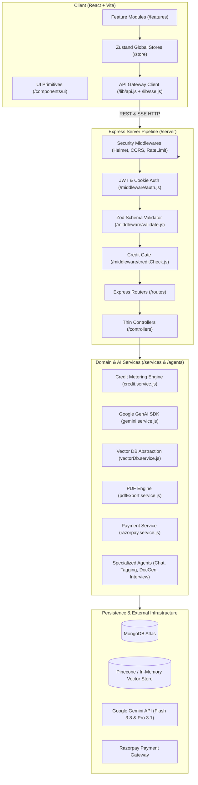
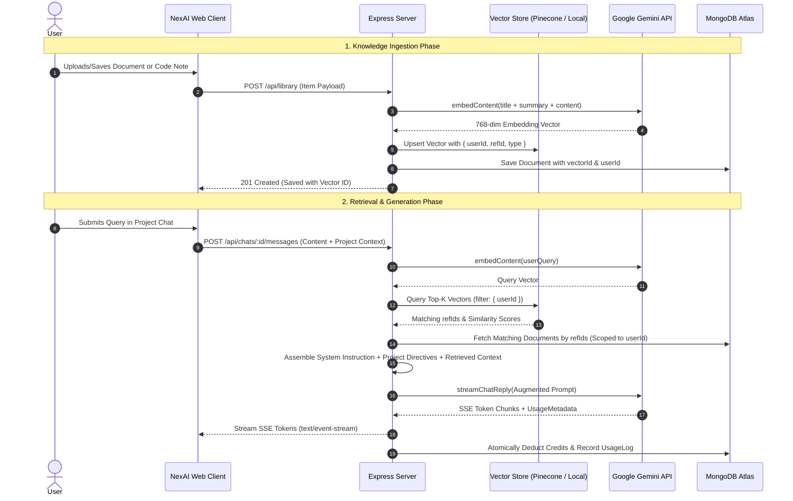

# NexAI — Comprehensive Viva Defense & Architecture Guide

> **Target Audience:** Capstone Defense Panel, External Examiners, Technical Evaluators  
> **Repository:** `NexAI Monorepo` (`/client` + `/server`)  
> **Status:** Production-Ready Hardened Architecture  

---

## 1. Executive Summary & Problem Statement

**NexAI** is an AI-powered personal and developer workspace designed to bridge the gap between fragmented productivity tools, developer utilities, and AI assistance. 

### The Problem with Existing Solutions
1. **Disconnected Context:** Developers and knowledge workers juggle disparate tools: ChatGPT/Claude for ad-hoc prompts, Notion for notes, LeetCode/Pramp for interview prep, and local text files for snippets. Context is constantly lost in copy-pasting.
2. **"AI Wrapper" Fragility:** Most modern AI apps are thin proxies that pass prompts to OpenAI/Anthropic with hard-coded markup, unmetered usage, and zero data ownership.
3. **Black-Box Billing:** Commercial tools charge flat $20/month subscriptions regardless of whether users consume 100 tokens or 1,000,000 tokens, or use opaque "credits" disconnected from actual LLM inference costs.
4. **Hallucination Persistence:** Most tools save LLM responses directly into databases without human verification, poisoning knowledge bases with hallucinations.

### The NexAI Solution
NexAI delivers an integrated workspace comprising **Multi-turn Chat**, **Polymorphic Knowledge Vault (Library)**, **Smart Document Generator (pdf-lib)**, **Prompt Engineering Hub**, **Project Knowledge Workspaces**, and an **AI Mock Interview Platform**. It is built on **real token-metered utility billing**, strict **Suggest-Review-Confirm** data sovereignty, and **tenant-isolated vector retrieval (RAG)**.

---

## 2. High-Level System Architecture

NexAI is structured as an enterprise-grade monorepo strictly separating the presentation layer from the domain and data layers.



### The Strict Monorepo Layering Contract
1. **Client Layer:** Pages compose feature components; feature components compose design system UI primitives (`components/ui`). Components **never** call `axios` directly; all I/O flows through typed Zustand store actions and `lib/api.js`.
2. **Server Pipeline:** Every request traverses `Security -> Auth -> Validation -> Credit Gate -> Controller -> Service/Agent`.
3. **Controller Rule:** Controllers remain strictly thin (extract input, delegate to services, format response). All business logic, database transactions, and Gemini API calls reside in `/services` and `/agents`.

---

## 3. The Retrieval-Augmented Generation (RAG) Pipeline

NexAI incorporates an isolated, multi-tenant RAG pipeline enabling context-aware retrieval across personal library notes, documents, and project knowledge sources.



### Key RAG Implementation Details
- **Multi-Tenant Filter Isolation:** Vector queries strictly pass `{ userId: req.user._id }` metadata filters. A user's vectors can never be searched or leaked to another tenant.
- **Provider-Agnostic Abstraction (`vectorDb.service.js`):** Implements an interchangeable interface (`upsertVector`, `querySimilar`, `deleteVector`). In production, it targets **Pinecone**; in development/testing or offline environments, it falls back to an **In-Memory Cosine Similarity Store**, ensuring zero environment lock-in.
- **Hybrid Search Strategy:** Unified search combines semantic vector similarity with MongoDB keyword index matching, ranking results accurately even when exact technical identifiers (function names, error codes) are queried.

---

## 4. Why NexAI is NOT an "AI Wrapper" (The 5 Core Architectural Moats)

When examiners ask: *"Isn't this just another wrapper around the OpenAI or Gemini API?"*, present these 5 technical pillars:

| Moat | Conventional AI Wrapper | NexAI Enterprise Architecture |
| :--- | :--- | :--- |
| **1. Billing Model** | Flat subscription or arbitrary counter (1 message = 1 credit). | **Atomic Token-Metered Utility Billing**: Credits directly track real LLM token counts (`ceil(totalTokens / 100)`). Atomically deducted via MongoDB `$inc` with floor protection. |
| **2. Data Integrity** | Blind auto-save: LLM output directly written to DB. | **Suggest-Review-Confirm Paradigm**: AI suggests tags, titles, summaries, and document drafts; user must explicitly review and confirm before persistence. Zero hallucination pollution. |
| **3. Vector Architecture** | Hardcoded third-party API dependency. | **Decoupled Vector Abstraction Layer**: Pluggable provider architecture with Pinecone and deterministic local cosine-similarity memory store. |
| **4. Security & Isolation** | Client-side API keys or unscoped DB queries. | **Zero Client Secrets & Strict Multi-Tenancy**: All AI keys server-side only; every MongoDB query and vector search filtered strictly by authenticated `userId`. |
| **5. Streaming Protocol** | Slow blocking REST calls or heavy WebSockets. | **Production Server-Sent Events (SSE)**: Unidirectional streaming with token chunking, custom event types (`event: token`, `event: done`, `event: error`), and fallback recovery. |

---

## 5. Top 10 Toughest Viva Defense Questions & Answers

### Q1: "Why not just use ChatGPT, Claude, or Notion AI directly?"
> **Answer:**  
> "General-purpose chat interfaces lack **workflow integration**, **financial transparency**, and **contextual persistence**:  
> 1. **Workflow Fragmentation:** In ChatGPT, if you generate a technical summary, you must manually copy it to Notion, convert it to a PDF with a third-party tool, and recreate prompt templates in local notes. NexAI connects these into an automated pipeline: Chat -> One-Click Suggest -> Vault Save -> Styled PDF Generation -> Prompt Hub.  
> 2. **Financial Sovereignty:** Notion AI charges $10/user/month regardless of usage. NexAI implements a transparent **utility model**: you pay only for the exact tokens consumed at ₹49/500 credits, metered by actual API token consumption.  
> 3. **Specialized Developer Workflows:** ChatGPT cannot conduct an interactive mock technical interview with real-time waveform visualization, structured rubric scoring, and automatic archival to an internal knowledge vault."

---

### Q2: "How do you prevent race conditions during concurrent AI requests deducting from the same user wallet?"
> **Answer:**  
> "We prevent race conditions using a two-stage concurrency defense:  
> 1. **Optimistic Pre-flight Check (`creditCheck.js`):** Verifies `user.wallet.creditsRemaining >= 1` before allowing the request to proceed to the Gemini agent, failing fast with HTTP 402 if depleted.  
> 2. **Atomic Execution Deduction (`credit.service.js`):** Credits are deducted using MongoDB's atomic `$inc` operator with an explicit conditional query:  
>    ```javascript
>    const user = await User.findOneAndUpdate(
>      { _id: userId, 'wallet.creditsRemaining': { $gte: creditsToDeduct } },
>      { 
>        $inc: { 
>          'wallet.creditsRemaining': -creditsToDeduct,
>          'wallet.totalTokensConsumed': tokensUsed 
>        } 
>      },
>      { new: true }
>    );
>    ```  
>    Because MongoDB executes single-document updates atomically at the storage engine level (WiredTiger document-level locking), two concurrent requests can never overdraw the balance below zero. If the conditional query fails, the operation safely logs an error and rejects without balance corruption."

---

### Q3: "What happens if the Gemini API goes down or returns a 500 error midway through an SSE stream?"
> **Answer:**  
> "Our streaming architecture implements defensive error containment:  
> 1. **SSE Protocol Error Framing:** If Gemini aborts mid-stream, our Express controller catches the exception inside the `async for` generator loop, logs the incident to `ErrorLog` in MongoDB, and dispatches a structured SSE error event (`event: error\ndata: {"message": "Streaming interrupted"}\n\n`) before closing the connection with `res.end()`.  
> 2. **Client Partial Persistence:** The client preserves all text tokens rendered up to the failure point, ensuring the user does not lose visible progress, and displays a non-blocking toast with a retry prompt.  
> 3. **Proportional Metering:** Tokens are only billed if the model provides usage metadata. If an error occurs before completion, the user is either billed only for partial tokens received or spared from credit deduction."

---

### Q4: "Why did you choose Server-Sent Events (SSE) over WebSockets for chat and interview streaming?"
> **Answer:**  
> "We evaluated WebSockets against SSE across three architectural criteria:  
> 1. **Protocol Complexity & Directionality:** LLM text generation is inherently **unidirectional** (client sends one prompt; server streams many token chunks back). WebSockets require full-duplex protocol negotiation, connection pooling, and ping/pong heartbeat management. SSE operates over standard HTTP/1.1 and HTTP/2, requiring zero protocol upgrades.  
> 2. **Infrastructure & Proxy Compatibility:** Corporate firewalls, API gateways (Render, Vercel, Nginx), and load balancers frequently drop or misconfigure WebSocket connections. SSE uses standard `text/event-stream` headers, making it natively compatible with standard HTTP infrastructure and HTTP/2 multiplexing.  
> 3. **Native Browser Resiliency:** Browsers provide built-in reconnection logic and simple `fetch()` readable stream decoding, keeping the client bundle lightweight without requiring socket libraries like `socket.io`."

---

### Q5: "How does your RAG system handle document updates or stale embeddings?"
> **Answer:**  
> "In `library.controller.js` (`updateItem`), whenever a user updates an item's title, summary, content, or sections, the backend detects if any text fields changed (`textChanged === true`).  
> If changed:  
> 1. It re-computes the composite representation of the document via `buildItemEmbeddingText()`.  
> 2. Generates a fresh 768-dimensional embedding vector via `geminiService.embedContent()`.  
> 3. Executes an idempotent upsert in the vector database using the existing `vectorId`.  
> 4. When an item is deleted via `DELETE /api/library/:id`, the backend executes `vectorDbService.deleteVector(item.vectorId)` in parallel with MongoDB document removal. This ensures the vector index never contains orphaned or stale embeddings."

---

### Q6: "How do you secure payment transactions against spoofing and balance tampering?"
> **Answer:**  
> "We implement a 3-layer security defense:  
> 1. **Server-Side Price Authority:** The client never passes price or credit amounts. The client only sends `{ planId: 'starter_pack' }`. Prices and credit quotas reside exclusively in server configuration (`config/plans.js`).  
> 2. **Cryptographic HMAC SHA-256 Verification:** When Razorpay completes a test checkout, the server verifies the payment signature using the server's private `RAZORPAY_KEY_SECRET`:  
>    ```javascript
>    const expectedSignature = crypto
>      .createHmac('sha256', env.RAZORPAY_KEY_SECRET)
>      .update(`${orderId}|${paymentId}`)
>      .digest('hex');
>    ```  
> 3. **Strict Idempotency:** The payment verification logic verifies that `paymentId` has not been previously credited. Once credited, the transaction state transitions from `pending` to `success` atomically, preventing replay attacks or double crediting."

---

### Q7: "Why did you build custom SCSS modules and CSS design tokens instead of using Tailwind CSS or Material UI?"
> **Answer:**  
> "Three reasons:  
> 1. **Design System Longevity & Token Discipline:** Tailwind leads to utility class clutter in JSX and makes cohesive theme switching brittle. By declaring design tokens (`styles/tokens/` and `styles/themes/`) as semantic CSS custom properties (`--color-bg-surface`, `--color-accent`, `--space-4`), switching between Dark and Light mode is instantaneous by simply toggling a `data-theme` attribute on the root DOM element.  
> 2. **Zero Framework Lock-in & Performance:** UI libraries like Material UI or Chakra UI introduce heavy runtime JavaScript CSS-in-JS overhead (emotion/styled-components) that inflates bundle sizes and degrades Interaction to Next Paint (INP). SCSS modules compile to pure, zero-runtime CSS with scoped class names at build time.  
> 3. **Visual Distinction:** Pre-built component libraries produce generic-looking interfaces. NexAI features a bespoke dark-mode-first aesthetic with refined micro-interactions and glassmorphic surfaces."

---

### Q8: "Explain your database indexing strategy for high-throughput multi-tenant data."
> **Answer:**  
> "We established compound and text indexes across all high-traffic collections in MongoDB:  
> - **`User` Collection:** Unique index on `email`.  
> - **`Chat` Collection:** Compound index on `{ userId: 1, updatedAt: -1 }` for instant retrieval of the user's recent chats without in-memory sorting.  
> - **`Message` Collection:** Compound index on `{ chatId: 1, createdAt: 1 }` ensuring sequential chronological message loading.  
> - **`LibraryItem` Collection:** Compound index on `{ userId: 1, createdAt: -1 }`, single index on `{ tags: 1 }`, and a multi-field **MongoDB `$text` Index** on `{ title: 'text', summary: 'text', content: 'text', tags: 'text' }` for lightning-fast keyword searches.  
> - **`UsageLog` Collection:** Compound index on `{ userId: 1, createdAt: -1 }` and `{ feature: 1, createdAt: -1 }` for real-time aggregation queries in the Admin Dashboard."

---

### Q9: "How does the system protect against prompt injection and model jailbreaking?"
> **Answer:**  
> "We apply defense-in-depth across the API and agent boundaries:  
> 1. **Input Boundary Validation:** Zod schemas validate and sanitize all inputs before touching controllers. Content lengths are bounded (e.g. 8000 character maximums) to prevent context-stuffing buffer overflows.  
> 2. **Structural Prompt Isolation:** User input is strictly separated from system instructions. In the Google GenAI SDK, system directives are passed via the dedicated `systemInstruction` configuration parameter, rather than string concatenation in the user turn. The model's attention mechanism assigns higher priority to `systemInstruction` over user turns.  
> 3. **Structured JSON Output Constraints:** For critical tasks like tagging, document drafting, and interview scoring, the model is configured with `responseMimeType: 'application/json'` and validated against strict Zod schemas (`scorecardOutputSchema`). If an attacker injects commands to break format, schema parsing fails, and safe fallbacks intercept the response."

---

### Q10: "If this application experienced a sudden surge to 100,000 active users, where would the architecture bottleneck first, and how would you scale it?"
> **Answer:**  
> "The bottlenecks and our scaling roadmap:  
> 1. **Bottleneck 1: Database Connections & Write Contention on UsageLogs:**  
>    *Solution:* Replace synchronous MongoDB write operations for `UsageLog` with an asynchronous event buffer (Apache Kafka or Redis Streams) with worker consumers batch-inserting logs (`insertMany`) every 5 seconds.  
> 2. **Bottleneck 2: Rate Limits on External LLM APIs:**  
>    *Solution:* Implement round-robin API key pools, multi-region Gemini enterprise endpoints, and caching identical query embeddings via Redis Semantic Cache.  
> 3. **Bottleneck 3: Node.js Event Loop Blocking under SSE Streams:**  
>    *Solution:* The Express server is currently stateless (JWT stored client-side and refresh tokens in HTTP-only cookies). It can scale horizontally across multiple instances behind an Nginx or AWS ALB reverse proxy with sticky sessions enabled for persistent SSE connections."

---

## 6. Live Viva Demonstration Script (3-Minute Flow)

When demonstrating NexAI live to examiners, follow this sequence:

1. **Step 1: Auth & Wallet Onboarding (30s)**  
   - Register a fresh user.  
   - Show that the account is automatically provisioned with **100 Starter Credits** (`free` tier).  
   - Open Settings/Wallet to show 0 tokens consumed.

2. **Step 2: Real-time Streaming & Atomic Metering (45s)**  
   - Switch model to **Gemini 3.8 Flash**.  
   - Ask: *"Explain circuit breakers in microservices in 3 concise bullet points."*  
   - Observe smooth token streaming via SSE.  
   - Notice the chat title automatically generated.  
   - Refresh Wallet: Show that tokens were accurately counted and credits deducted (`ceil(totalTokens / 100)`).

3. **Step 3: Suggest-Review-Confirm & Knowledge Vault (30s)**  
   - Click "Save to Library" on the generated message.  
   - Trigger "Auto-Tag": Show AI suggesting title, summary, and tags.  
   - Modify one tag manually (demonstrating human audit) and click Confirm.  
   - Navigate to Library: Show the saved card, filter by tag, and preview the item.

4. **Step 4: AI Mock Interview & Auto-Archival (45s)**  
   - Navigate to Mock Interview -> Select Role: *Frontend Engineer* -> Seniority: *Senior* -> Topic: *Web Performance*.  
   - Start session: Audio waveform visualizer activates with AI greeting.  
   - Provide an answer. AI streams contextual critique and the next challenge.  
   - Conclude interview: Comprehensive scorecard renders (Score: 92/100, Strong Hire, Category breakdowns).  
   - Jump to Library: Show that the interview session and scorecard were auto-archived.

5. **Step 5: Wallet Recharge & Admin Dashboard (30s)**  
   - Go to Wallet -> Select Starter Pack (₹49 for 500 Credits).  
   - Complete checkout in Razorpay test mode. Show immediate wallet credit (+500).  
   - Log in as Admin (`/admin`): Show real-time KPI cards, token consumption graph, Flash vs Pro model distribution, and the completed transaction in the ledger.
